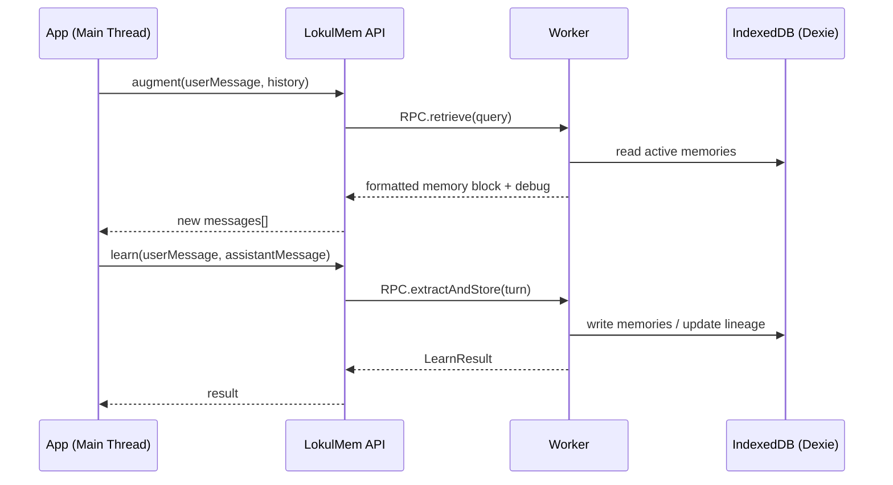

# LokulMem 🧠⚡

<p align="center">
  
</p>

<p align="center">
  <b>Browser-native</b> • <b>Zero-server</b> • <b>LLM-agnostic</b> memory management for web AI
</p>

<p align="center">
  <a href="#-quickstart">Quickstart</a> •
  <a href="#-why-lokulmem">Why</a> •
  <a href="#-api">API</a> •
  <a href="#-configuration">Config</a> •
  <a href="#-airgap--offline">Airgap</a> •
  <a href="#-architecture">Architecture</a> •
  <a href="#-export--import">Export/Import</a>
</p>

<p align="center">
  
  
  
  
  
  
  
  
  
</p>

---

## What is LokulMem?

**LokulMem** is a **local-first memory layer** you can drop into any browser AI:

- it **learns** durable facts from conversation turns,
- stores them in the browser (**IndexedDB**),
- **retrieves** the right memories on each prompt,
- and **injects** them into context within a token budget.

No backend. No vendor lock-in. Works with any LLM that accepts a `messages[]` array.

> It’s “RAG-like recall” + “memory lifecycle” (decay, pinning, contradiction history) + **transparent debugging**.

---

## ✨ Highlights

- **Runs entirely in the browser**: IndexedDB + Worker(s).
- **LLM-agnostic**: OpenAI / Anthropic / local WebLLM / anything with chat messages.
- **Memory lifecycle**: extract → store → decay/reinforce → retrieve → inspect/edit.
- **Contradiction resolution**: temporal updates vs conflicts, preserving lineage.
- **Token-aware injection**: uses your tokenizer (or a sensible fallback).
- **Inspectable by design**: optional debug output explains _why_ each memory was used.
- **DX-first defaults**: “fetch once, cache forever” model loading.
- **Airgap-ready**: strict local model loading via `localModelBaseUrl`.

---

## 🚀 Quickstart

### Install

```bash
npm i lokulmem
# or
pnpm add lokulmem
```

### Drop it into your chat loop

```ts
import { LokulMem } from "lokulmem";

// 1) Init once
const memory = await LokulMem.init({
  debug: true,
});

// 2) Before calling your LLM
const { messages, debug } = await memory.augment({
  userMessage: "Hey, I'm Alex. I prefer dark mode.",
  history, // your existing messages[]
  modelMaxTokens: 8192,
  reservedForResponse: 1024,
  // Optional: plug in your tokenizer for accurate budgets
  tokenCounter: (text) => myTokenizer.count(text),
});

// 3) Call any model/provider
const assistantMessage = await myLLM(messages);

// 4) After the response: learn from the turn
await memory.learn({
  userMessage: "Hey, I'm Alex. I prefer dark mode.",
  assistantMessage,
});

// Optional: inspect why memories were injected
console.log(debug);
```

---

## 🧩 Why LokulMem?

Most “memory layers” are server-first, framework-bound, or opaque.

LokulMem is for you if you want:

- **Privacy by architecture** (data stays on-device)
- **No backend** to deploy or secure
- A clean, library-shaped API that works with **any** model
- A memory system that users can **inspect, correct, pin, export, and delete**

---

## 🔧 API

LokulMem has three core surfaces:

### 1) `augment()` — retrieve + inject

Returns a new `messages[]` array plus optional debug metadata.

```ts
const { messages, debug } = await memory.augment({
  userMessage,
  history,
  modelMaxTokens: 8192,
  reservedForResponse: 1024,
  tokenCounter, // optional
});
```

### 2) `learn()` — extract + store

Extracts candidate memories from the last turn and writes them to IndexedDB.

```ts
const result = await memory.learn({
  userMessage,
  assistantMessage,
});

console.log(result.extracted);
console.log(result.contradictions);
```

### 3) `manage()` — list/search/edit/pin/export

For UI panels and power users.

```ts
const m = memory.manage();

const items = await m.list({ status: "active" }); // returns MemoryDTO (no embeddings)
await m.pin(items[0].id);

const exported = await m.exportJSON();
await m.clear();
await m.importJSON(exported, { conflictStrategy: "merge" });
```

---

## 🧾 Record vs DTO (performance boundary)

LokulMem uses a strict data boundary:

- **`MemoryRecord` (internal)** includes `embedding: Float32Array`.
- **`MemoryDTO` (public API)** omits embeddings entirely.

Why? Because typed arrays are expensive to structured-clone across IPC.

If you explicitly need embeddings (advanced), call APIs with `includeEmbedding: true` where supported.

---

## ⚙️ Configuration

```ts
const memory = await LokulMem.init({
  debug: false,

  // Worker
  workerUrl: undefined, // override if your bundler can’t resolve it

  // ONNX Runtime (CSP/offline)
  onnxWasmBaseUrl: "/lokulmem/onnx/",
  onnxWasmPaths: {
    // optional explicit mapping
    // 'ort-wasm.wasm': '/lokulmem/onnx/ort-wasm.wasm',
  },

  // Model loading
  allowRemoteModels: true, // DX default: fetch once, cache forever
  localModelBaseUrl: undefined, // set to enable strict airgap mode

  onProgress: (p) => console.log(p),
});
```

### Options

| Option              |                    Type |   Default | Notes                                      |
| ------------------- | ----------------------: | --------: | ------------------------------------------ |
| `debug`             |               `boolean` |   `false` | Adds `LokulMemDebug` from `augment()`      |
| `workerUrl`         |                `string` |      auto | Override worker script URL                 |
| `onnxWasmBaseUrl`   |                `string` |      auto | Base URL/dir for ORT assets                |
| `onnxWasmPaths`     | `Record<string,string>` |         — | Explicit ORT file mapping                  |
| `allowRemoteModels` |               `boolean` |    `true` | Fetch-once-cache-forever DX                |
| `localModelBaseUrl` |                `string` |         — | Airgap mode (maps to `env.localModelPath`) |
| `tokenCounter`      |        `(text)=>number` | heuristic | Accurate token budgeting                   |
| `onProgress`        |         `(stage)=>void` |         — | model/storage/maintenance progress         |

---

## 🧊 Airgap / Offline

Default mode is **DX-first**: download the embedding model once and cache it.

To run in strict airgapped mode:

1. Host the model assets locally (mirroring the expected model layout)
2. Point LokulMem at your local base URL

```ts
const memory = await LokulMem.init({
  localModelBaseUrl: "/models/",
  // Airgap mode sets:
  // env.allowLocalModels = true
  // env.allowRemoteModels = false
  // env.localModelPath = '/models/'
});
```

If assets are missing, LokulMem should fail loudly with an actionable error.

---

## 🏗️ Architecture



### Stores

- `memories` — durable facts (with embeddings)
- `episodes` — optional conversation segments
- `clusters` — k-means centroids (v0.1)
- `edges` — optional relationship links

---

## 🔍 Debug output

When `debug: true`, `augment()` returns:

- timings (embedding, retrieval, formatting)
- candidate list with score breakdown
- excluded reasons (low score, token budget, status)
- final injected memories with human-readable reasons

This is intentionally built so you can ship a **Memory Inspector** UI.

---

## 📦 Export / Import

- JSON export includes embeddings as **Base64** to survive JSON.stringify.
- Export metadata includes `version`, `schemaVersion`, `modelName`, `embeddingDims`.

```ts
const json = await memory.manage().exportJSON();
await memory.manage().clear();
await memory.manage().importJSON(json, { conflictStrategy: "merge" });
```

---

## 🛠️ Development

```bash
pnpm install
pnpm build
pnpm test
```

### Demo app (isolated workspace)

```bash
cd examples/react-app
pnpm install
pnpm dev
```

---

## 🧯 Troubleshooting

**Worker fails to load**

- Set `workerUrl` explicitly.
- Confirm the published package includes the worker chunk.

**ONNX WASM 404 / CSP blocked**

- Set `onnxWasmBaseUrl` or `onnxWasmPaths`.
- Confirm `ort-wasm*.wasm` and `ort-wasm*.mjs` are being served.

**Airgap mode can’t find model**

- Confirm `localModelBaseUrl` is reachable.
- Confirm model files exist under that path.

---

## 🤝 Contributing

PRs welcome. Please keep:

- Local-first behavior by default
- Public API DTO-only payloads
- No silent CDN fallbacks in airgap mode
- Stable types + strict TypeScript

---

## 📄 License

MIT (recommended). Replace with your actual license.
